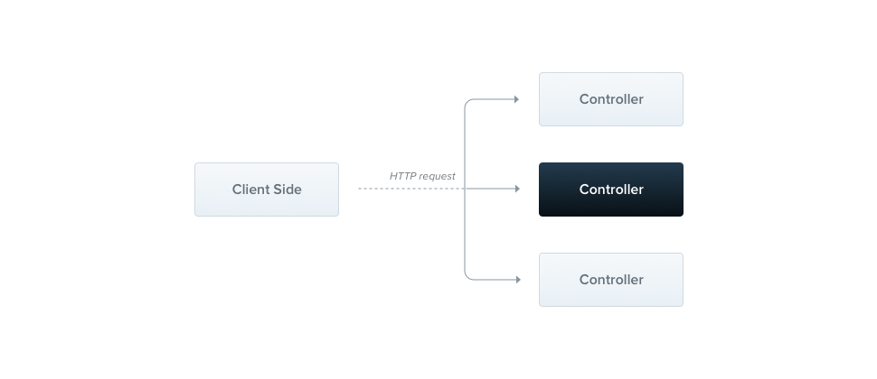

# Nest 概念

## 1 Controller

处理进入的 request，返回 response 到客户端。路由机制决定哪个路由由哪个 Controller 处理。



### 1.1 示例

```ts
// 新建 people/people.controller.ts

import { Controller, Get } from '@nestjs/common';

@Controller('people') // 'people' 是可选参数，用来指定路由前缀
export default class PeopleController {
  @Get() // 装饰器的参数可选，此例中对应 '/people' 的路由，若传入 'chinese'，则对应 '/people/chinese'。可以一定的正则形式。
  getAllPeople(): string {
    return 'All People';
  }
  
  @Get('promise')	// 路由 handle 支持异步，Nest 会自己 resolve
  async getAllPeoplePromise(): Promise<string> {
    return 'All People';
  }
  
  @Get('observable')	// 路由 handle 支持流，Nest 会自己订阅
  getAllPeopleObservable(): Observable<string> {
    return of('All People');
  }
}
```

- 使用装饰器 @Controller 定义 PeopleController 类是 Controller

- 使用装饰器 @Get 定义 getAllPeople 方法是一个路由 handle。这个 handle 对应了 get 方法 + '/people' 路由

- 对于 `return 'All People'` 返回值。在 Nest 中，有两种方式处理 Response

  1. 利用 Nest 内建机制。如果返回的是 array 或者 object，Nest 会将他们转换为 JSON，然后进行返回。如果是 JS 的原始类型的值，Nest 会直接返回值。
  2. 处理原生 Response。通过在 handle 中使用 `@Res` 或者 `@Next` 装饰器，可以获取原生 Response 对象，但设置状态码、返回等操作都需要自己完成。例如：`getAllPeople(@Res() res)`，其中，res 就是原生的 Response 对象。

  > 如果想两种方式一起使用，则需要使用形如：@Res({ passthrough: true })。一方面可以获取原生 Response，一方面可以将设置状态码等操作交给 Nest 使用

### 1.2 常用装饰器

- `@Req()、@Request()`。获取请求对象

- `@Res()、@Response()`。获取响应对象

- `@Next()`。代表 next

- `@Session()`。代表 req.session

- `@Query(key?: string)`。代表 req.query 或 req.query[key]

- `@Param(key?: string)`。代表 req.params 或 req.params[key]。需要配合路由参数标记使用，形如：

  ```ts
  @Get(':id')		// 路由参数标记
  findOne(@Param('id') id) {		// 添加了路由参数标记的 handle 需要放在静态路径 handle 的后面
    return id;
  }

  // 或者
  @Get(':id')
  findOne(@Param() params) {
    return params.id;
  }
  ```

- `@Body(key?: string)`。代表 req.body 或 req.body[key]

- `@Headers(name?: string)`。代表 req.headers 或者 req.headers[name]

- `@Ip()`。代表 req.ip

- `@HostParam()`。代表 req.hosts。可以配合 host 参数标记使用：

  - 因为在 `@Controller` 中，可以传入一个包含 host 属性的对象，用来指定接收的请求的 host 必须满足某个值。而且这个 host 的值，可以使用参数标记，可以用 `@HostParam()` 来获取这个参数标记。形如：

  ```ts
  @Controller({ host: ':name.example.com' }) // :name 就是参数标记
  export default class TestController {
    @Get()
    getHostName(@HostParam('name') hostName: string) {
      // 用 @HostParam 获取参数标记，赋值给 hostName
      // ...
    }
  }
  ```

- `@Get()、@Post()、@Put()、@Delete()、@Patch()、@Options()、@Head()、@All()`。分别对应各种的 HTTP 请求方法

- `@HttpCode(statusCode: number)`。设置对应的响应状态码。默认情况下总是 200，除了 Post 方法是 201

- `@Header(key: string, value: string)`。设置自定义的响应头

- `@Redirect(url: string, statusCode: number)`。设置重定向，后者的默认值是 302。可以被如下形式的 handle 的返回值覆盖：

  ```ts
  {
    "url": string,
    "statusCode": number
  }
  ```

## 2 Providers
