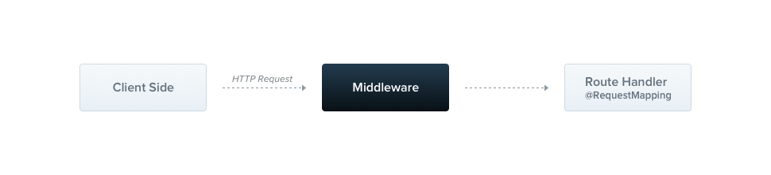

# Middleware

## 1 Middleware

- Middleware 是在 route handler 前执行的函数。Middleware 可以访问到 request 对象、response 对象以及 next 函数



- 可以分为 Class Middleware 和函数式 Middleware

### 1.1 Class Middleware

- 示例：

```typescript
// 新建 logger.middleware.ts

// Middleware 需要：
// 1、使用 @Injectable 进行装饰
// 2、实现 NestMiddleware 接口
// 3、实现 use 方法
@Injectable()
export default class LoggerMiddleware implements NestMiddleware {
  // Middleware 支持依赖注入
  constructor(private readonly commonService: CommonService) {}

  use(req: Request, res: Response, next: NextFunction) {
    // do logger work
    next();
  }
}
```

- 使用 Middleware：

```typescript
// app.module.ts

@Module({
  imports: [],
  exports: [],
  controllers: [],
  providers: [],
})
export default class AppModule implements NestModule {
  // 使用 Middleware 的模块，需要实现 NestModule 接口
  // Middleware 通过 configure 方法进行使用
  configure(consumer: MiddlewareConsumer) {
    consumer
      .apply(LoggerMiddleware, OtherMiddleware)
      // .forRoutes('people')

      // .forRoutes({
      //    path: 'people',		// path 可以一定的正则形式
      //   	method: RequestMethod.GET
      // })
      .forRoutes(PeopleController)
      .exclude({
        path: 'people',
        method: RequestMethod.GET,
      });
  }
}
```

### 1.2 函数式 Middleware

```typescript
// 重构 logger.middleware.ts

export default function logger(
  req: Request,
  res: Response,
  next: NextFunction,
) {
  // do logger work
  next();
}
```

### 1.3 全局 Middleware

- 一次在所有路由绑定某一个 Middleware

  - 在入口文件使用 use 方法（只能使用函数中间件）

    ```typescript
    // main.ts

    const app = await NestFactory.create(AppModule);

    app.use(SomeMiddleware);
    await app.listen(3000);
    ```

  - 在任意模块内使用 `.forRoutes('*')`（可以使用 class 或者函数式中间件）
