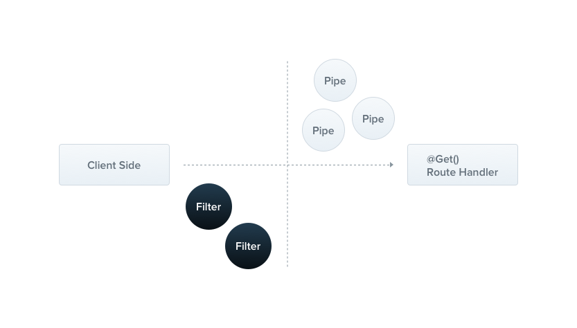

# 4 ExceptionFilters

Nest 内置一个**异常层**，负责处理应用程序中未被捕获的异常，即未被业务代码捕获的异常，都将由其捕获。这种机制由内建的 `Global Exception Filter` 完成，它处理类型为 `HttpException` 的异常，当异常不是此种类型时，其无法识别并抛出如下错误：

```json
{
  "statusCode": 500,
  "message": "Internal server error"
}
```



## 1.1 标准异常

- Nest 提供了一个内建的标准异常类 `HttpException`，使用如下：

```ts
// people.controller.ts

@Get('error')
throwAError() {
  throw new HttpException('Forbidden', HttpStatus.FORBIDDEN);
}
```

其对应的返回响应如下：

```json
{
  "statusCode": 403,
  "message": "Forbidden"
}
```

- `new HttpException(response, status, options)` 接收两个必填参数和一个可选参数

1. response 定义 JSON 响应体，可以为一个字符串，也可为一个对象。若为对象，其结构为：
   1. statusCode。默认为 status 的值
   2. message。对错误的描述
2. status 定义 HTTP 状态码
3. options 中可以定义 case，case 不会序列化后展示给用户，但可用于将内部错误记录于日志。

## 1.2 自定义异常

即继承标准 `HttpException` 创建自己的 Exception 类。例如：

```ts
// 新增 fastForbidden.exception.ts

export default class FastForbiddenException extends HttpException {
  constructor() {
    super('Forbidden', HttpStatus.FORBIDDEN);
  }
}

// people.controller.ts
@Get('diyError')
throwADiyError() {
  throw new FastForbiddenException();
}
```

## 1.3 自定义异常过滤器

让用户拥有对**异常层**的完全控制权，控制控制流和返回给客户端的响应内容。

1. 自定义一个异常过滤器，形如：

   ```ts
   // 新增 http-exception.filter.ts

   // @Catch() 装饰器定义该异常过滤器要处理的异常类型，此例为 HttpException
   @Catch(HttpException)
   export default class HttpExceptionFilter implements ExceptionFilter {
     // 所有自定义的异常过滤器，都需要实现 ExceptionFilter 接口，并实现 catch 方法
     // catch 方法包含两个参数：exception 代表抛出的异常，host 代表当前的执行上下文对象
     catch(exception: HttpException, host: ArgumentsHost) {
       const ctx = host.switchToHttp();
       const response = ctx.getResponse<Response>();
       const request = ctx.getRequest<Request>();
       const status = exception.getStatus();

       response.status(status).json({
         statusCode: status,
         timestamp: new Date().toISOString(),
         path: request.url,
       });
     }
   }
   ```

2. 使用方面，形如：

   ```ts
   // people/people.controller.ts

   // 这里会将抛出的异常先交付给 HttpExceptionFilter 处理，并可以自定义响应内容给客户端
   @Get('diyError')
   @UseFilter(HttpExceptionFilter)
   throwADiyError() {
     throw new FastForbiddenException();
   }
   ```

3. 使用全局异常过滤器，形如：

   ```ts
   async function bootstrap() {
     const app = await NestFactory.create(AppModule);

     app.useGlobalFilters(new HttpExceptionFilter()); // 这里不能进行依赖注入，因为是发生在所有模块之外的
     await app.listen(3000);
   }
   bootstrap();
   ```

4. 但是可以通过如下方式进行全局异常过滤器的依赖注入：

   ```ts
   // 从任何一个模块进行都可
   @Module({
     providers: [
       {
         provide: APP_FILTER,
         useClass: HttpExceptionFilter,
       },
     ],
   })
   export default class AppModule {}
   ```

## 1.4 半自定义异常过滤器

即继承内建的 BaseExceptionFilter，来实现部分的自定义，形如：

```ts
@Catch()
export default class AllExceptionFilter extends BaseExceptionFilter {
  catch(exception: unknown, host: ArgumentsHost) {
    // do something
    super.catch(exception, host);
  }
}
```
