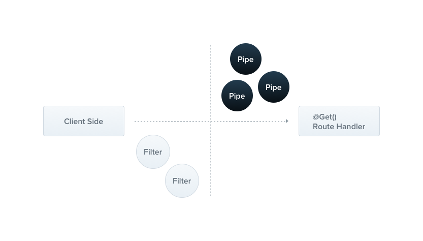

# Pipes_Guards

## 1 Pipes

1. 被 `@Injectable()` 装饰器修饰
2. 实现 `PipeTransform` 接口



### 1.1 内建 Pipes

-   ValidationPipe
-   DefaultValuePipe
-   ParseIntPipe
-   ParseFloatPipe
-   ParseBoolPipe
-   ParseArrayPipe
-   ParseUUIDPipe
-   ParseEnumPipe
-   ParseFilePipe

### 1.2 使用 Pipes

形如：

```typescript
// people.controller.ts

import { Controller, Get, Param, ParseIntPipe } from '@nestjs/common';

@Controller('people')
export default class PeopleController {
    constructor(private readonly someService: SomeService) {}

    @Get(':id')
    async findOneById(
        @Param('id', new DefaultValuePipe(0), ParseIntPipe) id: number,
    ) {
        // 1. ParseIntPipe 会保证要么 id 为数值。要么类型转化失败，抛出异常
        // 2. 此处使用了依赖注入。也可以手动传入实例化对象，形如：@Param('id', new ParseIntPipe({ errorHttpStatusCode: HttpStatus.NOT_ACCEPTABLE }))
        // 3. DefaultValuePipe 会保证在 id 缺失的情况下，给 ParseIntPipe 传入默认值 0
        return this.someService.find(id);
    }
}
```

### 1.3 自定义 Pipes

1. 基础例子：基本使用

    ```typescript
    // something.pipe.ts

    import {
        ArgumentMetadata,
        Injectable,
        PipeTransform,
    } from '@nestjs/common';

    @Injectable()
    export default class SomethingPipe implements PipeTransform<T, R> {
        // 1. 自定义 Pipe 类需要实现 PipeTransform 接口的 transform 方法
        // 2. value 即 route handle 的参数，例如 1.2 中的 id。metadata 即对应的元数据
        transform(value: T, metadata: ArgumentMetadata): R {
            return value;
        }
    }

    // metadata 数据结构：
    export interface ArgumentMetadata {
        type: 'body' | 'query' | 'param' | 'custom'; // 获取 value 的方式
        metatype?: Type<unknown>; // value 的声明类型
        data?: string; // 传入装饰器的字符串
    }
    // 以 1.2 为例，metadata为
    const metadata = {
        type: 'param',
        metatype: Number,
        data: 'id',
    };
    ```

2. 进阶例子：基于 Schema 的校验

    ```typescript
    // zodValidation.pipe.ts

    @Injectable() // TODO Liam: 官方文档这里没有使用装饰器，需要确认？
    export default class ZodValidationPipe implements PipeTransform {
        constructor(private schema: ZodSchema) {}

        transform(value: unknown, metadata: ArgumentMetadata) {
            try {
                const parsedValue = this.schema.parse(value);

                return parsedValue;
            } catch (error) {
                throw new BadRequestException('Validation failed');
            }
        }
    }

    // someSchema.dto.ts
    import { z } from 'zod';

    export const createSomeSchema = z
        .object({
            name: z.string(),
            age: z.number(),
            breed: z.string(),
        })
        .required();

    export type CreateSomeDto = z.infer<typeof createSomeSchema>;

    // people.controller.ts
    import { Controller } from '@nestjs/common';

    @Controller('people')
    export default class PeopleController {
        @Post('testZod')
        @UsePipes(new ZodValidationPipe(createSomeSchema))
        test(@Body() createSomeDto: CreateSomeDto) {
            // do somethinig
        }
    }
    ```

3. 进阶例子：基于装饰器的校验

    ```typescript
    // some.dto.ts
    import { IsString, IsInt } from 'class-validator';

    export default class SomeDto {
        @IsString()
        name: string;

        @IsInt()
        age: number;
    }

    // SomeValidation.Pipe.ts
    // 其实不用自己实现 SomeValidationPipe，因为 Nest 提供了内置的 ValidationPipe
    import {
        Injectable,
        PipeTransform,
        ArgumentMetadata,
        BadRequestException,
    } from '@nestjs/common';
    import { validate } from 'class-validator';
    import { plainToInstance } from 'class-transformer';

    @Injectable()
    export default class SomeValidationPipe implements PipeTransform<T, R> {
        async transform(value: T, metaData: ArgumentMetadata): R {
            const { metatype } = metadata;

            if (!metatype || !this.toValidate(metatype)) {
                return value;
            }

            // 将传入的无类型对象使用装饰器（metatype）进行类型装饰
            const object = plainToInstance(metatype, value);
            // 进行类型验证
            const errors = await validate(object);

            if (errors.length > 0) {
                throw new BadRequestException('Validation failed');
            }

            return value;
        }

        private toValidate(metatype: Function): boolean {
            const types: Function[] = [String, Boolean, Number, Array, Object];
            return !types.includes(metatype);
        }
    }

    // people.controller.ts
    import { Controller, Body, Post } from '@nestjs/common';

    @Controller('people')
    export default class PeopleController {
        @Post()
        test2(@Body(new SomeValidationPipe()) body: SomeDto) {
            // do something
        }
    }
    ```

### 1.4 全局 Pipes

```typescript
// 方案一：不能使用依赖注入的方式，因为在所有模块之外
// main.ts
async function bootstrap() {
    const app = await NestFactory.create(AppModule);

    app.useGlobalPipes(new ValidationPipe());
    await app.listen(3000);
}

bootstrap();

// 方案二：变通使用依赖注入
// xxxxx.module.ts（任意模块文件中）
import { Module } from '@nestjs/common';
import { APP_PIPE } from '@nestjs/core';

@Module({
    providers: [
        {
            provide: APP_PIPE,
            useClass: ValidationPipe,
        },
    ],
})
export class AppModule {}
```

## 2 Guards

1. 被 `@Injectable()` 装饰器装饰
2. 实现 `CanActivate` 接口
3. 决定 `request` 是否会被 `Route Handle` 处理
4. 与中间件相比，主要优势在于可以知道 **执行上下文**
5. 执行顺序方面：Middleware --> Guard --> Pipe --> Interceptor


### 2.1 使用 Guards

-   以身份验证器为例

    ```typescript
    // myAuth.guard.ts
    import {
        CanActivate,
        ExecutionContext,
        Get,
        Injectable,
    } from '@nestjs/common';

    @Injectable()
    export default class MyAuthGuard implements CanActivate {
        // 实现 CanActivate 接口的 canActivate 方法
        // context 为执行上下文
        canActivate(
            context: ExecutionContext,
        ): boolean | Promise<boolean> | Observable<boolean> {
            const request = context.switchToHttp().getRequest();
            // do something with request
        }
    }

    // people.controller.ts
    import { Controller, UseGuards } from '@nestjs/common';
    @Controller('people')
    @UseGuards(MyAuthGuard)
    export default class PeopleController {
        // ...
    }
    ```

### 2.2 全局 Guards

-   形如

    ```typescript
    // main.ts
    const app = await NestFactory.create(AppModule);

    app.useGlobalGuards(new RolesGuard());

    // 或者

    // 任意 xxxx.module.ts 中
    import { Module } from '@nestjs/common';
    import { APP_GUARD } from '@nestjs/core';

    @Module({
        providers: [
            {
                provide: APP_GUARD,
                useClass: RolesGuard,
            },
        ],
    })
    export class AppModule {}
    ```
